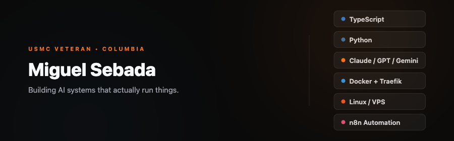

  

---

### Currently building

- **[AI Agent Swarm](https://github.com/mbsebada/ai-agent-swarm)** — Multi-agent platform with intelligent routing, provider failover, and self-healing monitoring
- **[LearnVPS](https://learnvps.com)** — Step-by-step VPS tutorials from real production experience
- **[Blog](https://github.com/mbsebada/blog)** — Technical writing on AI agents, LLMs, and infrastructure

### Writing

- [The 6 Types of LLMs — And Why the Categories Are Wrong](https://github.com/mbsebada/blog/blob/main/posts/2026-03-22-llm-types-ai-agents.md)
- [How I Built a Self-Healing AI Agent Swarm](https://learnvps.com/tutorials/ai-agent-swarm/)
- [How to Set Up Your First VPS](https://learnvps.com/tutorials/set-up-your-first-vps/)

### Stats

  
  

